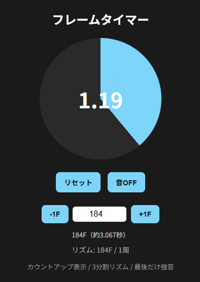

# FEZ Pw Cycle Timer

幻想大陸（FEZ）の Pw 回復周期を体感・確認するためのフレームベースタイマーです。ぽんぽんぱっ

## 公開ページ
https://shiteru.github.io/fez-pw-cycle-timer/

## できること
- Pw回復周期を円形タイマーで視覚的に確認
- 音で周期のリズムを確認
- フレーム数を直接指定して調整
- リセットして 0 から周期を測り直し

## 使い方
1. ページを開く
2. フレーム数を入力する（例: 184F）
3. 必要に応じて `-1F` / `+1F` で微調整する
4. リセットボタンで周期を 0 から測り直す
5. 音ON/OFFでリズム確認を切り替える

## メモ
- 現在は自分用の検証ツールとして作成中です
- FEZ内の実際の挙動を見ながらフレーム値を調整して使う想定です

## スクリーンショット

This project is licensed under the MIT License.
